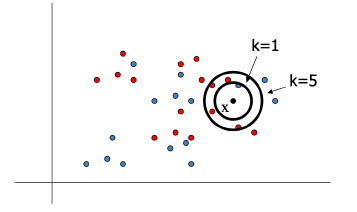
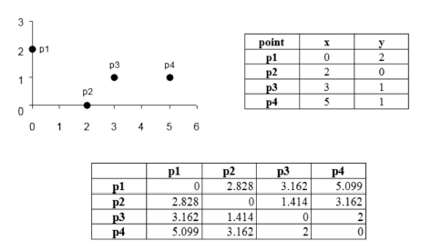
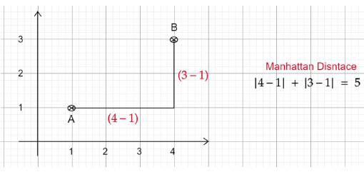
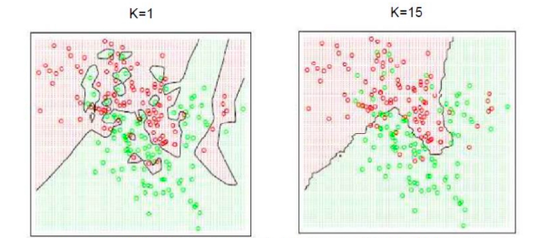
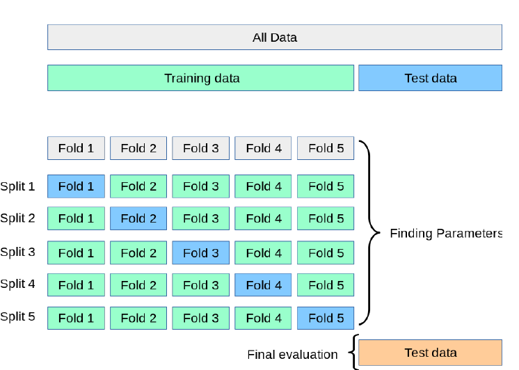

# K-nearest Neighbors Algorithm

<!-- HCI Summer 22' :) -->

> A Non-parametric model 

+ Fast Training (Pro)
+ Easy to understand 
+ Testing is slow
+ Curse of dimensionality
	+ Higher dimensionality causes distance functions to disregard dimensions.
	+ Think: $\langle 1, 0, \dotso, 0 \rangle$ vs $\langle 0, \dotso, 1, 0 \rangle$ 

## Parametric methods
A Parametric model is where there is a *training* phase to learn the model parameters.

Examples:
1. [[Week 4.01 - 02 07 23 -  Linear Regression]]
2. [[Week 5.01 - 02 14 23 - Logistic Regression]]

The issue with Parametric models is that there is a strong bias in selecting the model distribution which *may* not reflect real-world data. 

## K-nearest Neighbors Method for Class Selection
Given an input vector $\vec{x}$ to be classified:
1. find the $K$ nearest Neighbors of $\vec{x}$
2. Find the majority label of those $K$ data points (vectors)
	+ Ex labels: $[1, 2, 4, 1, 1, 2, 6] \to 1$
3. Assign $\vec{x}$ to that label.

Given $K=1$ , $\vec{x}$ will belong to `Blue` yet if $K=5$ , $\vec{x}$ will belong to `red`.

### "Training" KNN
The training phase is simply storing vectors.

### Predicting Classes
To get the "closest" $K$ vectors we would need some form of distance. 
#### Euclidean distance

$$
D(\vec{x}, \vec{y}) = \|\vec{x}-\vec{y}\|_2
$$

> $\|  \|_2$ is the $\ell_2$ norm

#### Manhattan distance

$$
D(\vec{x}, \vec{y}) = \|\vec{x}-\vec{y}\|_1
$$

> $\|  \|_1$ is the $\ell_1$ norm

--- 
#### Prediction
The next step is to make the classification.

The larger $K$ is the better the boundary between class. 

### Choosing $K$

To choose a $K$ we can use Cross-validation.

1. Split training data into $K$ folds.
2. $K-1$ folds for training, $1$ for validation 

For each hyperparameter, train model $K$ times and evaluate it $K$ times. Use the $K$ with the highest average accuracy. 