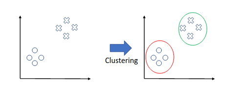
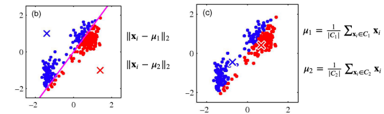
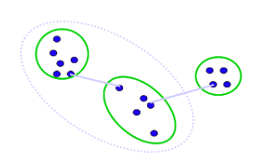

# Clustering

> There exists no week 7: It was midterm week

## Intro to Clustering
Clustering is a form of **Unsupervised Learning** where a model is trained with samples with no *labels*. 

The point of clustering is to group samples together.

## Measures of Similarity
> How do we measure similarity?

### Euclidean distance
Given $\vec{x}$ and $\vec{y}$ ,

$$
d = \|\vec{x} - \vec{y}\|_2 
$$

With this method and using Manhattan Distance ( $\ell_1$ ), distance is **inversely correlated** with similarity.

## Partition methods
Partition methods are used to construct partitions which are later evaluated. 

Example Methods:
+ K-Means
+ Gaussian Mixture Model
+ Spectral Clustering

### K-Means

Given samples $\{\vec{x}_i\}_{i=1}^{n}$ , K-Means partitions it into K clusters where each cluster has a centroid, a point in space where it is the center of "cluster". 

#### K-Means steps
##### Initialize 
Randomly select points in space that serve as the "guesses" for centroids.

> Centroids will be refered to as $\mu_k$

##### Stabilize $\mu_i$ 

After selecting $\mu_i\biggr|_{i=1}^K$ , we can iterate over all points and assign a cluster based on which centroid it is closest to. 

Then we can move the centroids to the center of the newly created masses. 

> In the image above $\times$ represents the initial guesses (random) for centroids for $K=2$ . 

Anyways, iterating over this process will grant finer clusters. 

#### K-Means - Analysis
+ Pros:
	+ Easy to understand / implement
	+ Efficient at $O(KNT)$
		+ $K$ - K
		+ $T$ - Iteration count
		+ $N$ - Sample count
+ Cons:
	+ Sensitive to initial guesses and outliers

## Hierarchical methods
> Create a hierarchical decomposition of the set of objects using some criterion

Methods:
1. Bottom up: Start with all samples in their own partition and combine the two most similar partitions until there are none left to combine
2. Top down: Start with a single partition and separate down to all samples in their own partition 

### Agglomerative Clustering (Bottom up) 

> The primary question here is "How to combine two clusters?"

Notice all the methods below are of order $O(N^2)$ for $N$ being the sample count. 

#### Single Link
When comparing two clusters the two closest samples are considered as the metric. This leads to long "skinny" clusters.

> Notice the "closer cluster" is chosen for merging

$$
d_{\min}(D_i, D_j) = \min_{\vec{x}\in D_i, \vec{y}\in D_j} \|\vec{x} - \vec{y}\|
$$

> $D_i$ represents a cluster.

#### Complete Link

Opposite of "Single Link". 

$$
d_{\max}(D_i, D_j) = \max_{\vec{x}\in D_i, \vec{y}\in D_j} \|\vec{x} - \vec{y}\|
$$

When two clusters are considered to be combined, the furthest distance is used for linking. 

#### Average link
For each sample in both clusters a distance is computed and averaged in to make a decision about linking:

$$
d_{\text{avg}}(D_i, D_j) =  \frac{1}{|D_i||D_j|} \sum_{\vec{x}\in D_i} \sum_{\vec{y}\in D_j} \|\vec{x} - \vec{y}\|
$$

