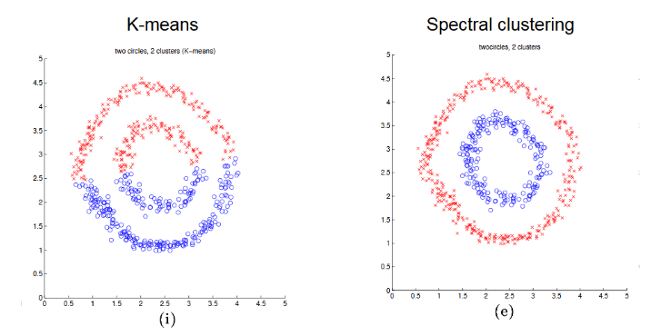
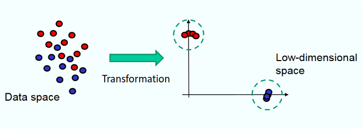
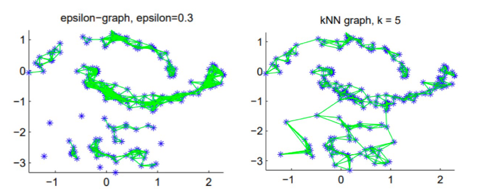

# Spectral Clustering
The primary issue with clustering algorithms like K-Means is they are not able to detect complex shapes. 

This is the problem Spectral Clustering aims to solve.

The idea is to transform the data points using a new mapping and use K-Means:

## Similarity Graphs
Here is a list of methods of creating Similarity Graphs

> A Similarity Graph connects two samples if they are 'related'

1. $\epsilon-\text{neighborhood graph}$ 
	+ Connect all samples that have a distance of $\epsilon$ or less to each other
2. $k-\text{nearest neighbor graph}$
	+ Connect $v$ to $u$ if $v$ is among the "closest" $k$ neighbors to $u$
3. Fully connected graph
	+ Connect all points with a similarity $\gt 0$ with each other

> Graphs will be represented by an adjacency matrix $\mathbf{W}$

### Method 1,2 - Epsilon NN & k-NN

$$
\mathbf{W}_{ij} = 
\begin{cases}
1 & \|x_i - x_j\| \leq \epsilon \\
0 & \text{else}
\end{cases}
$$

**Example Runtime:**

### Method 3 - Similarity Matrix

$$
\mathbf{W}_{ij} = e^{-\frac{\|x_i - x_j\|^2}{2\sigma^2}}
$$

$\sigma$ is a hyperparameter and controls the size of the neighborhood. By increasing $\sigma$ , the "normal curve" gets wider but maintains its $\mu$ (mean) at 0.[^1]

## Graph Background Info WRT ML

The degree is represented by:
$$d_i = \sum_j w_{ij}$$

The matrix $\mathbf{D}$ represents the diagonal matrix:

$$
\begin{bmatrix}
d_1 & 0 & \dotso & 0 & 0 \\
0 & d_2 & \dotso & 0 & 0 \\
\vdots &  & \ddots & \vdots & \vdots \\
0 & \dotso & 0 & d_{n-1} & 0 \\
0 & \dotso & 0 & 0 & d_n
\end{bmatrix}
$$

### Graph Laplacian matrix

> $W$ is that similarity matrix

+ **UNnormalized**: $L = D-W$ 
+ **normalized**: $L_{rw} = D^{-1}L = I - D^{-1}W$

### Objective Function
Given a similarity matrix $W$ the goal would be to:

$$
\min {\sum_{i, j}^n} w^2_{ij}(f_i - f_j)^2
$$

> Above is the `1d` objective function

Where $f_i$ is the low-dim representation of $\vec{x_i}$ .

Notice that for larger $w_{ij}$ their lower representations should be closer. 

[^1]: As it should, recall we are looking at vector similarity here. 

