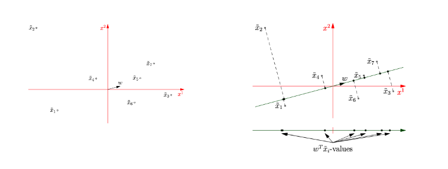

# Dimensionality Reduction
## Importance
1. [[Week 2 - 01 26 23 - Exploratory Data Analysis]] 
	+ By reducing samples from $k$ dimensions to $2$ or $3$ , the sample space can be visualized. 
2. Curse of dimensionality:
	+ See overfitting @[[Week 4.02 - 02 07 23 - Extending Linear Regression and Using Regression]]
	+ In short, having too many attributes leads to the metric of distance losing distance. 
3. Computational cost
	+ Less components $\implies$ less cost to perform operations on data
4. Noise reduction
	+ "the real-life data are often noisy and looking at any individual attribute might not provide any insight"
	+ Combining features "smartly" that were noisy into new ones might reveal new properties of the data

## Combining Features
### Principal Components Analysis (PCA)
> A dimensionality reduction method. 

It uses a linear transformation to find a new coordinate system for the dataset. It attempts to preserve the variance if possible. 

### Intro
We are given $n$ samples:

$$
\{x_{i}\}_{i=1}^n \text{ for } x_i \in \mathbb{R}^d
$$

Goal:

Find $W \in \mathbb{R}^{d \times k}$ such that:
+ $d$ is the number of original components
+ $k$ is the number of new components

### Math
#### First component:

Let $\tilde{x}_i = x_i - \bar{x}$ where $\bar{x}$ is the average vector. 

Then let $\tilde{X} = [\tilde{x}_1\ \dotso\ \tilde{x}_n]$

Apply the linear transformation:

$$
\{w^T\tilde{x}_1\ \dotso\ w^T\tilde{x}_n\}
$$

And finally compute the variance:

$$
\overbrace{\frac{1}{n} \sum_{i=1}^n w^T(\bar{x} - x_i)}^{\text{def of Variance}} \to
\frac{1}{n} \sum_{i=1}^n w^T\tilde{x}_i
$$

The way to get $w$ is to maximize the variance in the new coordinate system and making it a unit vector.

$$
\max_{\|w\|_2=1} \frac{1}{n} \sum_{i=1}^n w^T\tilde{x}_i
$$

Visual:

> **RECAP**: So far we have used PCA to build the first component in our dim reduction. This is the direction with the maximum variance. 

The visual above shows the projection to a singular dimension. This is done via $w^T$ since $w^T \cdot \vec{x}_i \in \mathbb{R}$ .

The point is, by finding a $w^T$ that has the most variance we have found the first dimension for PCA.

#### Second principal component

$$
\max_{\stackrel{{\|w\|_2=1}}{w \perp w_1}} \frac{1}{n} \sum_{i=1}^n w^T\tilde{x}_i
$$

So we far we have the first component:

$$
\vec{w}_1 = [w^T_1\tilde{x}_1\ \dotso\ w^T_1\tilde{x}_n]
$$

Now the second from the optimization above:

$$
\vec{w}_2 = [w^T_2\tilde{x}_1\ \dotso\ w^T_2\tilde{x}_n]
$$

If we only wanted two dimensions:

$$
\hat{X} = {W^T}\tilde{X} \in \mathbb{R}^{2 \times n}
$$

Note: $W_T = [w_1 w_2]^T$ where $\dim W^T = \mathbb{R}^{2 \times d}$ and $\dim{\tilde{X}} = \mathbb{R}^{d \times n}$

> This can be extended to $k$ dimensions:

$$
\max_{\stackrel{{\|w\|_2=1}}{w \perp_{i=1}^{k-1}w_i }} \frac{1}{n} \sum_{i=1}^n w^T\tilde{x}_i
$$