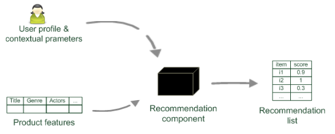
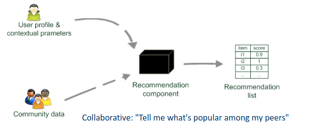

# Recommender System

> Final projects were introduced today.

+ Provide users personalized recommendations about content they may be  interested in. 
	+ Examples:
		+ Amazon: Product Recommendations
		+ Google: Search Recommendations

## Content-based filtering
> "Show more of what of the same ive like before"

So based on what the user has liked before we find "similar" items based on the features of that item that was liked before. 

## Collaborative Filtering (CF)
**Data Given**:
1. Set of Users
2. Set of Items
3. Feedback for item by user

In CF, ratings of like-minded are utilized to provide recommendations based on the assumption: "Users who have expressed similar interests in the past will share common interests in the future."

### Memory based CF: User-CF
**Motivation**: If users have similar tastes in the past, they will have similar tastes in the future. 

If we want to give recommendations to person $k$ about item $i,$ we have to find a number of peers who liked the same items as $k$ and have rated item $i$ and use that information to predict of $k$ will like $i$ .