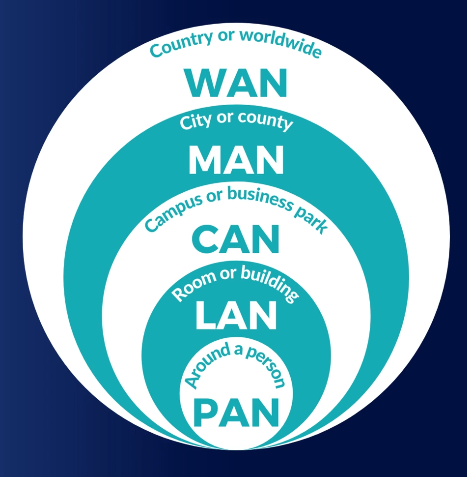

# Network Geography
Tags: #1_2

In this note, each subsequent heading talks about a larger network, thus the last network spans the greatest area.

## PAN - Personal Area Network
The smallest type of network possible: 10ft or less.
An example of this is Bluetooth which operates at a radial distance of 10 meters. While BT is wireless, a PAN does not have to be wireless. 

A hard-drive connection is also a PAN since it will transmit serialized data. 

## LAN - Local Area Network
The range on a LAN is a *few hundred ft*. We can think of a LAN as one floor of an office building.

Your networks usually consist of either 
#net_standards
1. Ethernet (IEEE 802.3)
2. Wi-Fi (IEEE 802.11)

An example of a LAN is using your home internet. This **LAN** establishes connections between your devices like other computers and printers. 

## CAN - Campus Area Network
Connects LANs that are building-centric over an area. This is popular in a university. This can range up to several miles. 

## MAN - Metropolitan Area Network
Connects locations around a city. Ranges up to 25mi.  
An example of this is a college that has many sub-campuses scattered near each other. Each of their CANs can be connected to form a much larger MAN. Another examples are Police stations. 

## WAN - Wide Area Network
The last one on this list. A WAN connects geographically distinct (far away) networks and consists of leased lines and VPNs. This can be statewide, countrywide or *worldwide*. The WWW is a WAN!

Not all WANs are public. We can think of the US govt., the DOD's WAN is not public. 

## Final Diagram
#diagram
