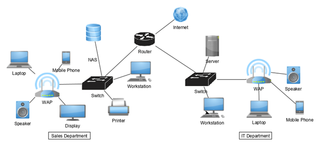
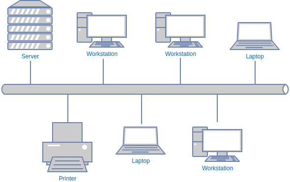
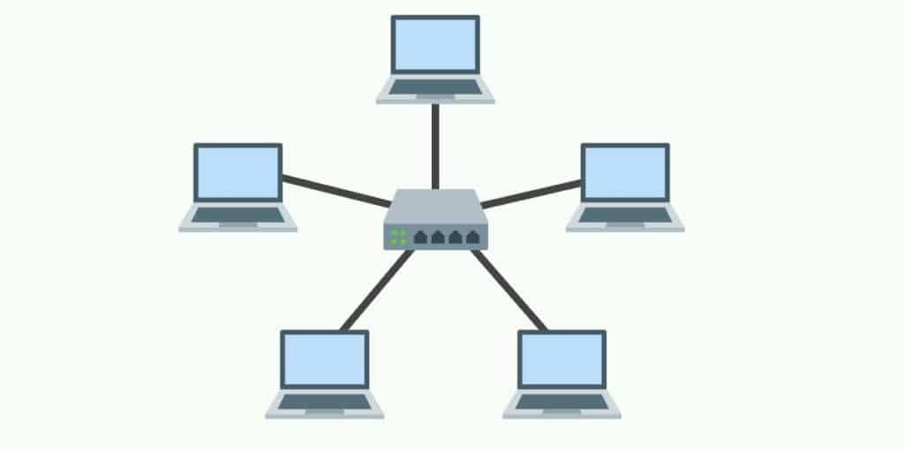

# Wired Network Topology
tags: #1_2 

> **topology**: the way in which constituent parts are interrelated or arranged 

Network Topology is concerned with how a network is laid out. This can mean one of two things:
1. Physical - How devices are conned by media. This is like cable or wiring. 
2. Logical: How the traffic flows between machines like computers, switches, routers and much more. 

This is an example of a **Logical** Network Diagram. 
A *logical* diagram will ***not*** describe the locations of things **only** the connects will be shown. 

## Named Typologies 
### Bus Topology 
This Topology uses a single cable to connect all the devices. Each device will "tap" into the cable using a vampire-tap or a T-connector.

This single cable is known as a "backbone".
> **vampire-tap**: an old technology where a single cable would transport data and each device would have to *bite* into the cable to receive data.

Image from: [online.visual-paradigm](https://online.visual-paradigm.com/diagrams/templates/network-diagram/bus-topology-template/)

Each devices forms a **single collision domain**. The word collision comes from the fact that if all computers talk at the same time the cable would not be able to process it. 

### Ring Topology
Uses a cable running in a circular loop where each device connects to the ring but data travels in **one** direction.

We can attach a token to each message to let other devices know *who* sent the message. This is known as a token ring. This token would prevent collisions present in the *Bus Topology*

If we cut a ring, the network will fail. 
We can however *FDDI* ring to curb this issue. A FDDI ring will have an additional counter directional ring to create redundancy. Modern **RING** networks are usually FDDI Rings. (Ring = Redundancy)

> **FDDI**: Fiber Distributed Data Interface

### Star Topology

Image from: [comparitech](https://www.comparitech.com/net-admin/network-topologies-advantages-disadvantages/)

This one is the **most popular**
Each device in the ST talks to one central computer.

<!-- LESSON:  4:52-->